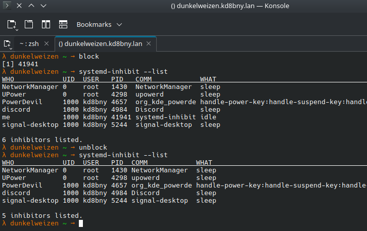

+++
title = "Keeping sessions alive with systemd-inhibit"
date = "2025-05-10T21:59:34-05:00"
#dateFormat = "2006-01-02" # This value can be configured for per-post date formatting
author = "daryl"
cover = ""
tags = ["linux", "systemd", "bash", "ssh", "inhibit"]
keywords = ["linux", "systemd", "bash", "ssh", "inhibit"]
description = "Lets learn how to use systemd-inhibit to block systems idle states."
showFullContent = false
readingTime = true
hideComments = false
+++
In my Home Lab network I use my desktop for most of my development. Since it's a desktop and not a server it abides by the power policy setting I have selected. This works great unless I'm working a remote session from anything else such as my laptop, cell, etc.

My usual workflow is just an ssh session with tmux, where I wake up the system by issuing a Wake on LAN (wol) from an always on server. After the typical timeout around 30 mins the system goes to sleep which drops the session and forces me to send another wol and reconnect via ssh and then reattach to tmux.


*annoying* eh? So here is what I came up with.

## So what

On systemd enabled systems the blocking of suspend/sleep actions can be controlled by `systemd-inhibit. Usually when you block sleep from the desktop environment it's using this same mechanism under the hood. So, what does it do?

> Let us rtfm
>
> systemd-inhibit - Execute a program with an inhibition lock taken
>
> systemd-inhibit [OPTIONS...] [COMMAND] [ARGUMENTS...]
>
> systemd-inhibit may be used to execute a program with a shutdown, sleep, or idle inhibitor lock taken.
> The lock will be acquired before the specified command line is executed and released afterwards.
>
> …

So basically the inhibit action will block sleep until the chosen executable exits. Although useful, I find this to be cumbersome thinking ahead; what do I want to run, should it be blocking, or is it long-running enough for what I want to do. I need something more flexible.

## Let's make it happen

**The Requirements:** We need a long-running process that never exits, can't suck pointless resources, and needs to be easy to kill. So lets slap a few things together and see how they work.

```sh
systemd-inhibit --no-ask-password --what=idle --who="me" --why="cuz I said so" sh & disown; export INHIBIT_PID=$!
```

## k cool what does this do

### Set the block

Since we aren't hand jamming the command each time we want to inhibit the power policy, we can take advantage of some niceties the cli provides.

- `no-ask-password` - we are already authenticated as this user. No reason to ask for a pass again and even more-so it blocks the execution requiring input
- `what` - Specify idle as a normal user doesn't need escalation to block idle
- `who` - a user or application name
- `why` - a mildly descriptive reason for the block
- `sh & disown` - and finally our command we send straight to the background

So what is this funky thing `sh & disown`. We need a long-running process that doesn't exit. For general compatibility I thought `sh` was a wise choice as it's pretty much guaranteed to exist. We also background this process, so it doesn't bug us and take up an active TTY.
We immediately disown it after sending it to background to ensure the job isn't attached to
our currently session. If we didn't do this our jobs would prevent an ssh exit. If we
did end our ssh session uncleanly the job would die and our inhibit would be removed.

After the command is run we nab the PID of the inhibit process by using `$!`, allowing us we can recall it later as `INHIBIT_PID`

### And now let us unblock

When we wrap up our session and would like the system to sleep again the second alias can be used to kill our captured PID. Here we use a KILL signal instead of TERMINATE or another polite signal because the process is background without input and therefore is suspended. A suspended process cannot exit unless it's running. Since we don't really care about data-loss (because the process isn't doing anything aside from existing) a KILL is fine.

After some consideration, I determined running the commands in an incorrect order or sequence after many sessions could leave you with trying to kill a PID that isn't what you want. So now when unblock is run let's set the PID back to an empty value ensuring we don't kill something we don't expect. `INHIBIT_PID=`

```sh
kill -SIGKILL $INHIBIT_PID; INHIBIT_PID=
```

## Add a little QoL

Using bash aliases we can make this a little more straight forward for the workflow. Place these 2 lines in your `.bashrc`, `.zshrc` etc. etc.

```sh
alias block='systemd-inhibit --no-ask-password --what=idle --who="me" --why="cuz I said so" sh & disown; export INHIBIT_PID=$!'
alias unblock='kill -SIGKILL $INHIBIT_PID; INHIBIT_PID='
```

## Test it

We can validate the process is actively inhibiting using `systemd-inhibit --list`


We can now step through this process in our workflow, issue a `block` followed by an `unblock` wrapping up our session.



Well hope you found this useful or more than you needed to know.

## What about

You may wonder, so couldn't I just use something like [caffeine](https://github.com/pkage/caffeine) instead of all that bash. Yes, yes you can.

-daryl
